## About me 
### Full name: Anani Thierry Kassa
### Student ID: 041140713

## Task 1: Deploy an Azure SQL Database

### Method1:
1. Configure Azure SQL database for Canada central region under your resource group cst8912-demo, choose single database under sql databases in sql deployment option 

2. Enter the following values in create database page and keep other properties with their default settings  
Subscription: Select your Azure subscription
Resource group: CST8912demo
Database name: db8912
Server: Select Create new and create a new server with a unique name in any Canada central location. Use SQL authentication and specify your name as the server admin login and a suitably complex password (remember the password - you'll need it later!)
Server : db8912demo
Username:db8912yourname
Password: dfguyt@234!
Want to use SQL elastic pool?: No
Workload environment: Development
Compute + storage: Leave unchanged
Backup storage redundancy: Locally-redundant backup storage
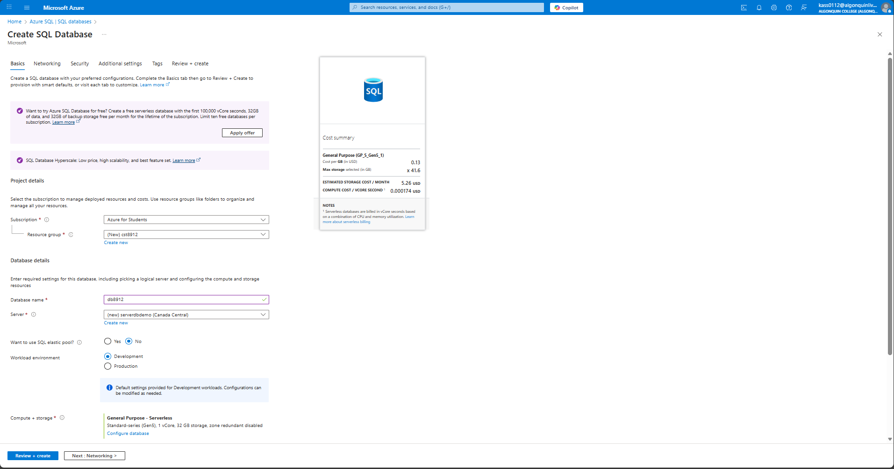

3. On the Create SQL Database page, select Next :Networking >, and on the Networking page, in the Network connectivity section, select Public endpoint. Then select Yes for both options in the Firewall rules section to allow access to your database server from Azure services and your current client IP address.
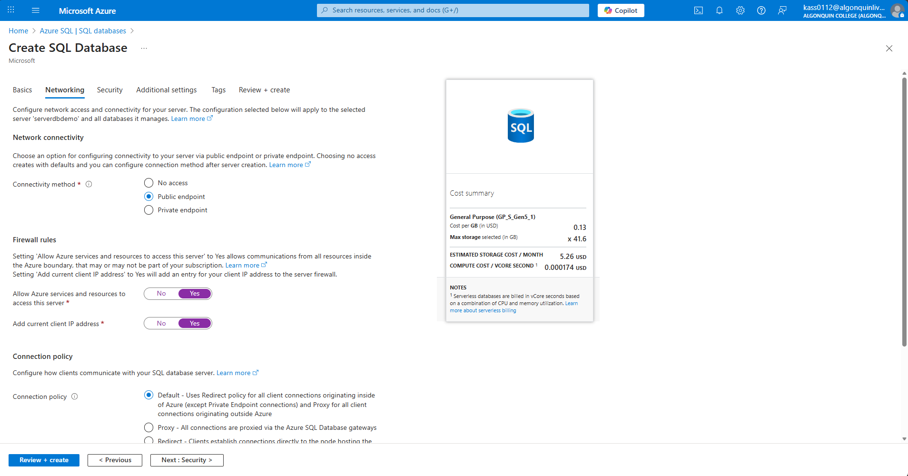

4. Select Next: Security > and set the Enable Microsoft Defender for SQL option to Not now.
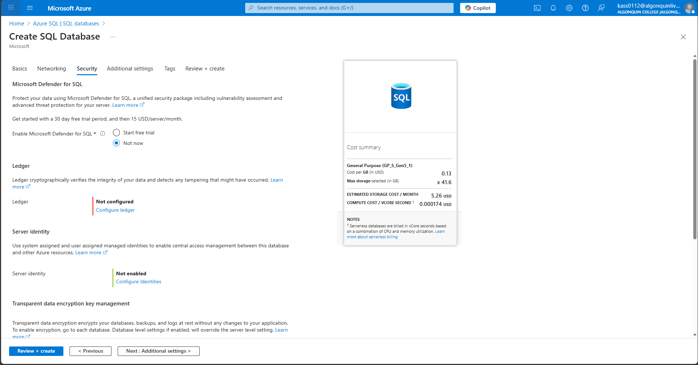

5. Select Next: Additional Settings > and on the Additional settings tab, set the Use existing data option to Sample (this will create a sample database that you can explore later).
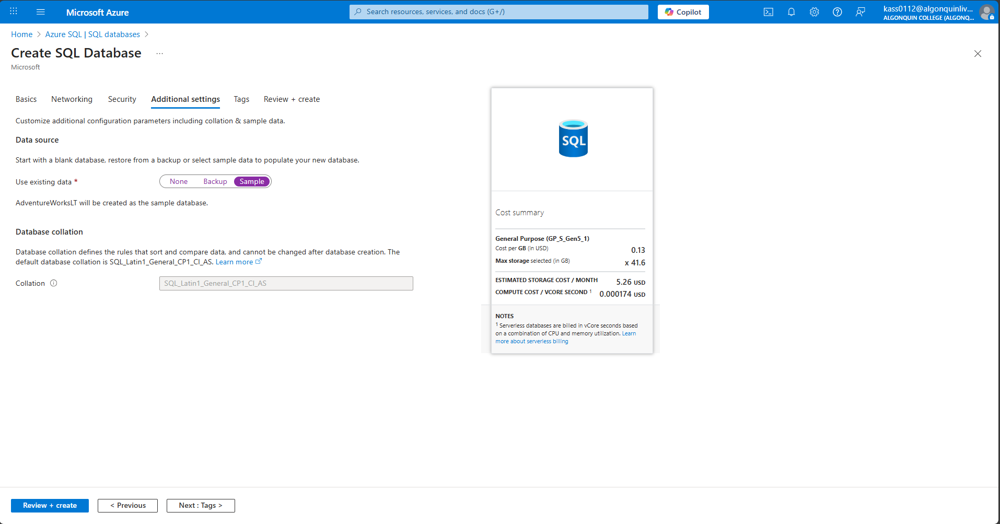
6. Select Review + Create, and then select Create to create your Azure SQL database.
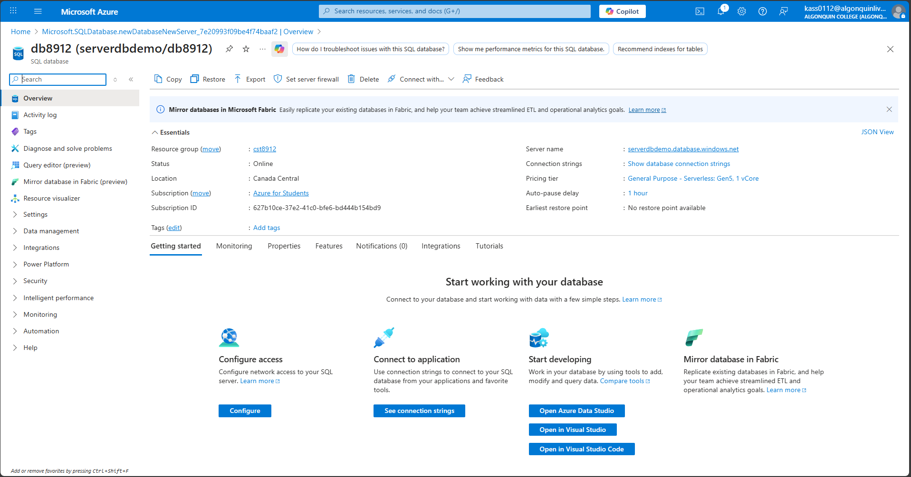

## Task 2: Configure Advanced Data Protection
1.	On the SQL server blade, in the Security section, click Microsoft Defender for Cloud, select Enable Microsoft Defender for SQL.
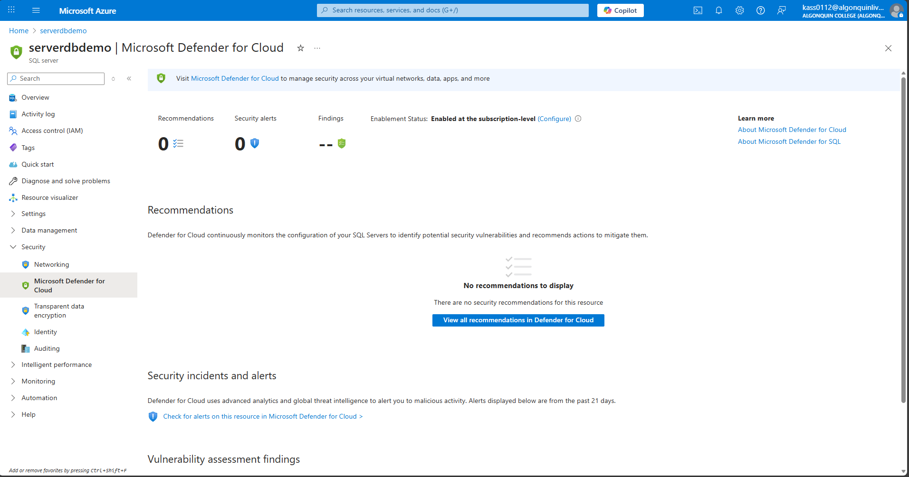

2.	On the SQL server blade, in the Security section, on the Microsoft Defender for Cloud page, in the Microsoft Defender for SQL: Enabled at the subscription-level (Configure) parameter, click (configure)

3.	On the Server Settings blade, review the information about pricing and the trial period, VULNERABILITY ASSESSMENT SETTINGS and ADVANCED THREAT PROTECTION SETTINGS.
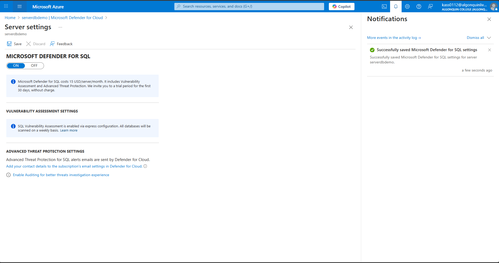
4.	Back to Microsoft Defender for Cloud blade, review Recommendations and Security alerts.

## Task 3: Configure Data Classification

In this task, you will explore and classify data in SQL database for GPDR and data protection compliance.
1.	On the SQL server blade, in the Settings section, click SQL Databases.
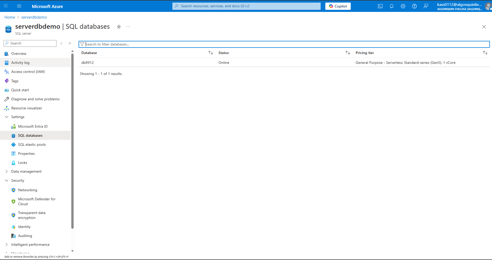
2.	On the SQL database blade, in the Security section, click Data Discovery & Classification.
3.	On the Data Discovery & Classification blade, click the Classification tab.
4.	Click the text message We have found 15 columns with classification recommendations displayed on blue bar at the top of the blade.
5.	Review the listed columns and the recommended sensitivity label.
6.	Enable the Select all checkbox and then click Accept Selected Recommendations.
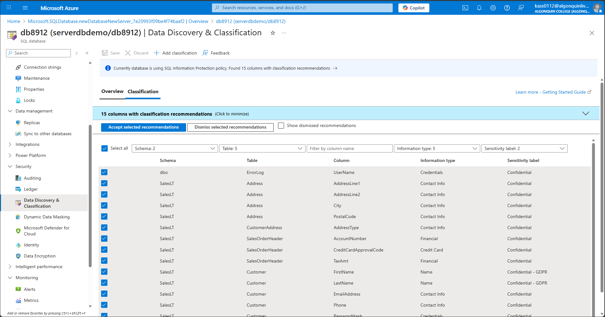
7.	Once you have completed your review click Save.
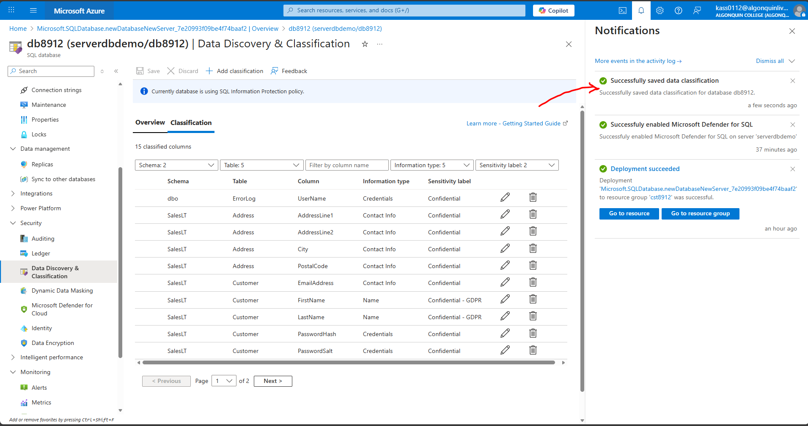
8.	Back on the Data Discovery & Classification blade Overview tab, note that it has been updated to account for the latest classification information.
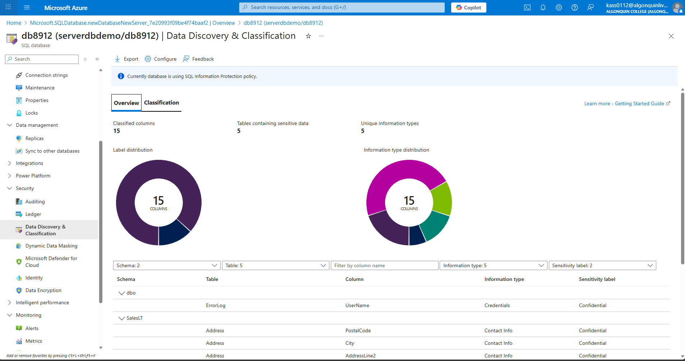

## Task 4: Configure Auditing
In this task, you will first configure server level auditing and then configure database level auditing.
1.	In the Azure portal, navigate back to the SQL Server blade.
2.	On the SQL Server blade, in the Security section, click Auditing.
3.	Set the Enable Azure SQL Auditing switch to ON to enable auditing
4.	Select the Storage checkbox and entry boxes for Subscription and Storage Account will display (create new storage account if not selected)
5.	Choose your Subscription from the dropdown list.
6.	Click Storage account and choose Create new.
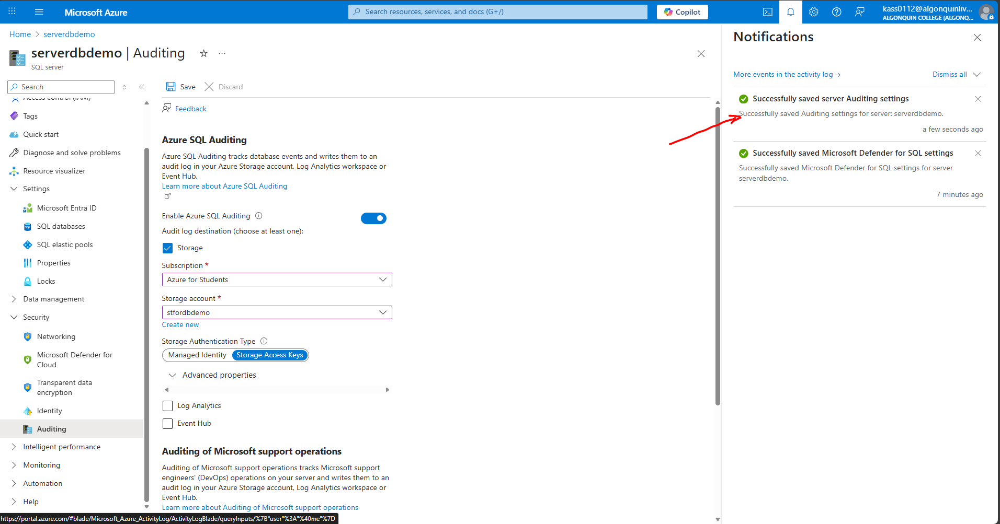
7.	Back on the Auditing blade, under Advanced properties set Retention (days) to 5.
8.	On the Auditing blade, click Save to save the auditing settings

9.	On the server blade, in the Settings section, click SQL Databases.
10.	On the SQL database blade, in the Security section, click Auditing.
Note: This is database level auditing. Server-level auditing is already enabled.
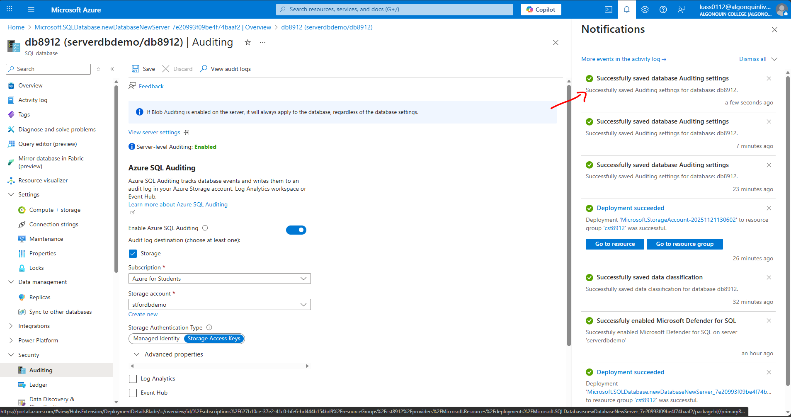
11.	On your SQL database Overview page in the Azure portal, select Query editor (preview) from the left menu. Try to sign in, you might fail on password, firewall rule for your IP address, everything gets audited. Try successful login as well, run query and you might find more details in audit logs
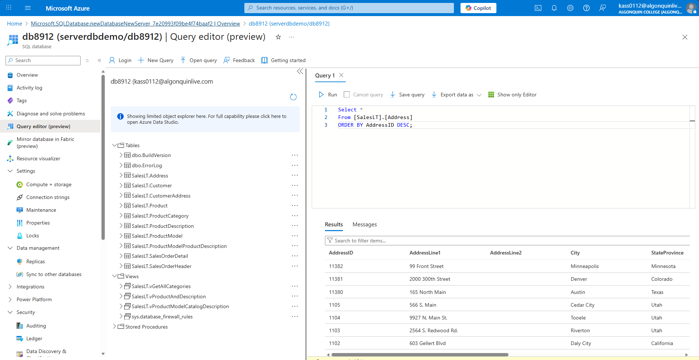
12.	switch back to DB, Auditing and Click View Audit Logs.
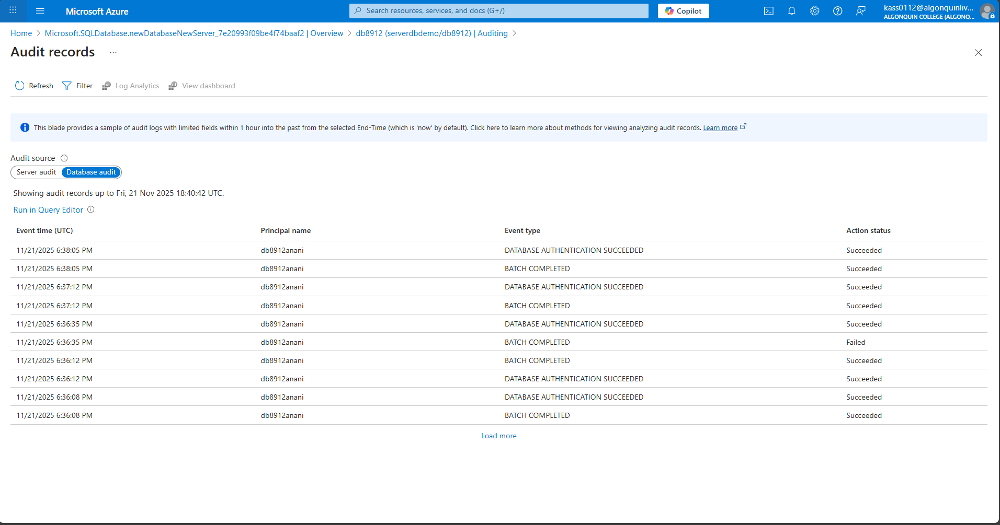
13.	On the Audit records blade, note that you can switch between Server audit and Database audit.
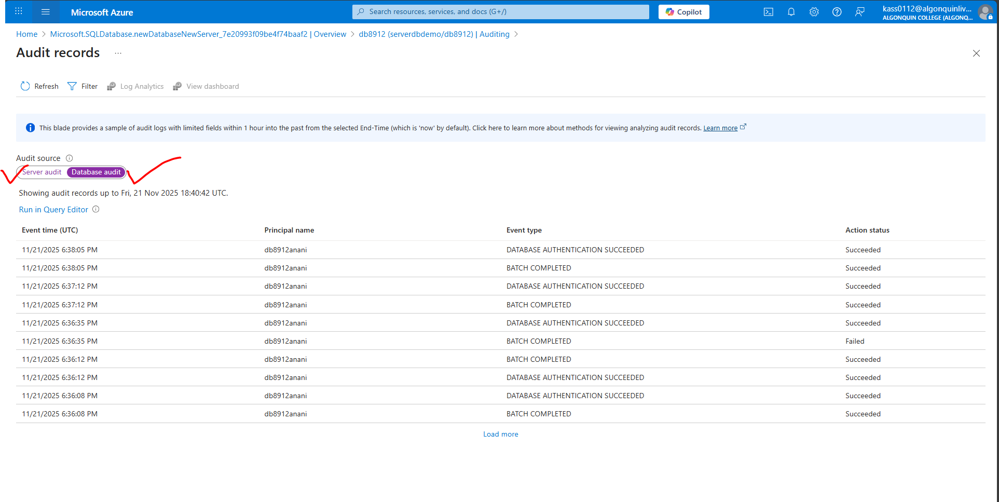

## Task 5: Clean up resources created during this lab
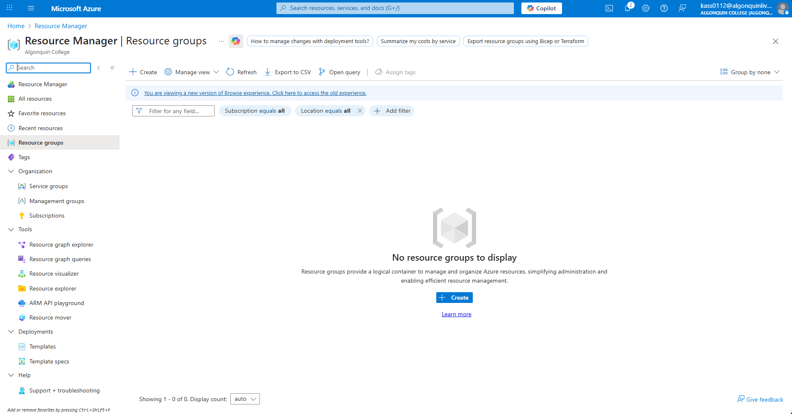