## Lab details
- Lab 2 week 3
- Course: **25F_CST8912_011 Cloud Solutions Architect**
- Name: **Anani Thierry Kassa**
- student ID: **041-140-713**

## Step-by-step documentation
1. Resource Group creation
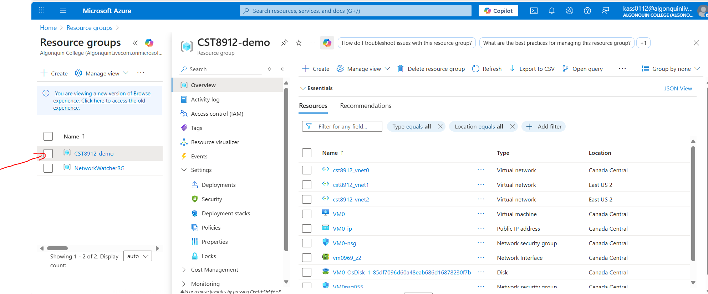

2.	Virtual Networks
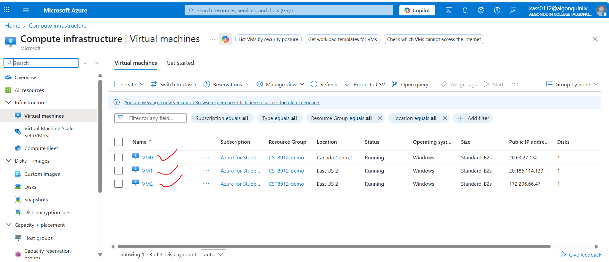

3. Peering configuration
    - vnet0
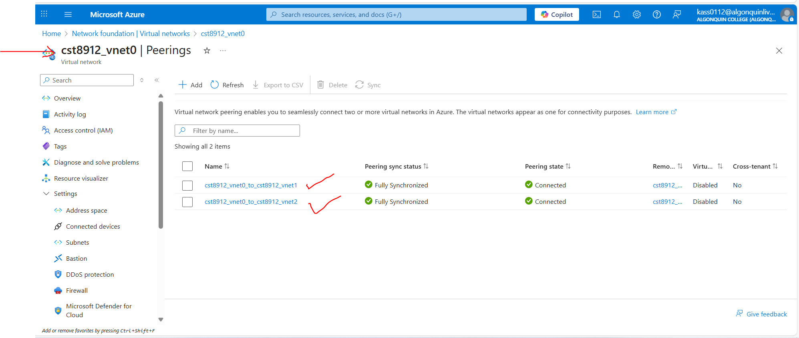
    - vnet1
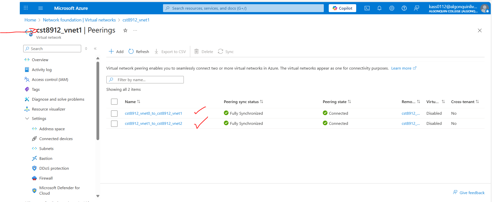
    - vnet2
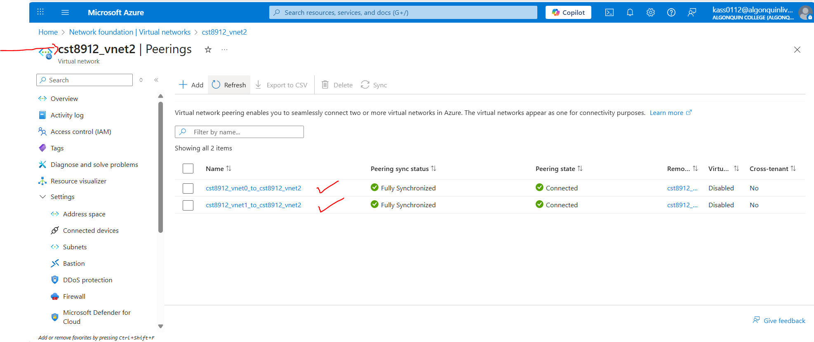

4. VM deployments
    - VM0
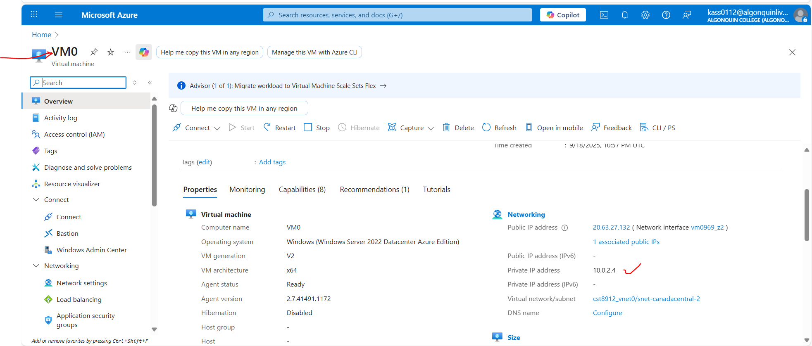
    - VM1
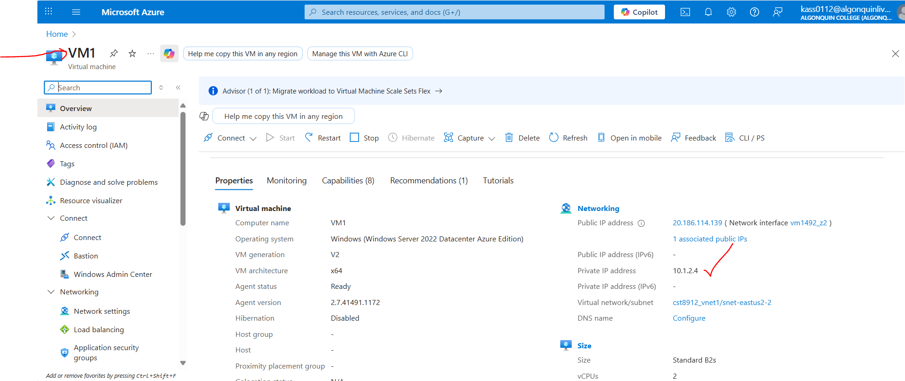
    - VM2
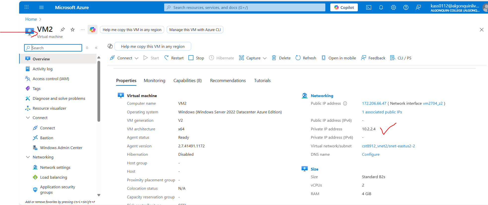

5. PowerShell Test-NetConnection results
    - From VM0 → VM1
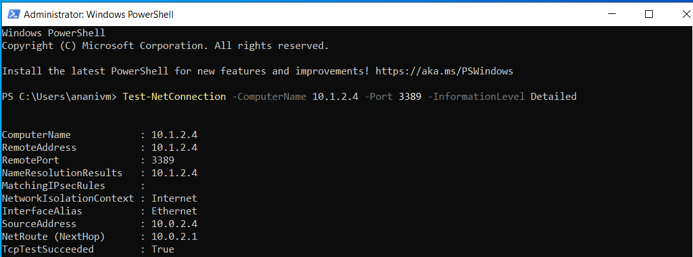
    - From VM0 → VM2
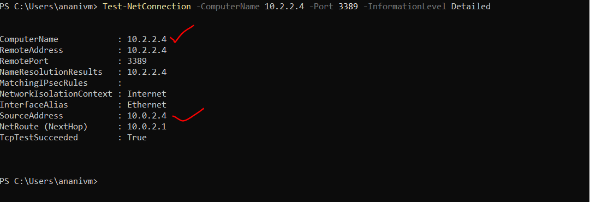
    - From VM1 → VM2
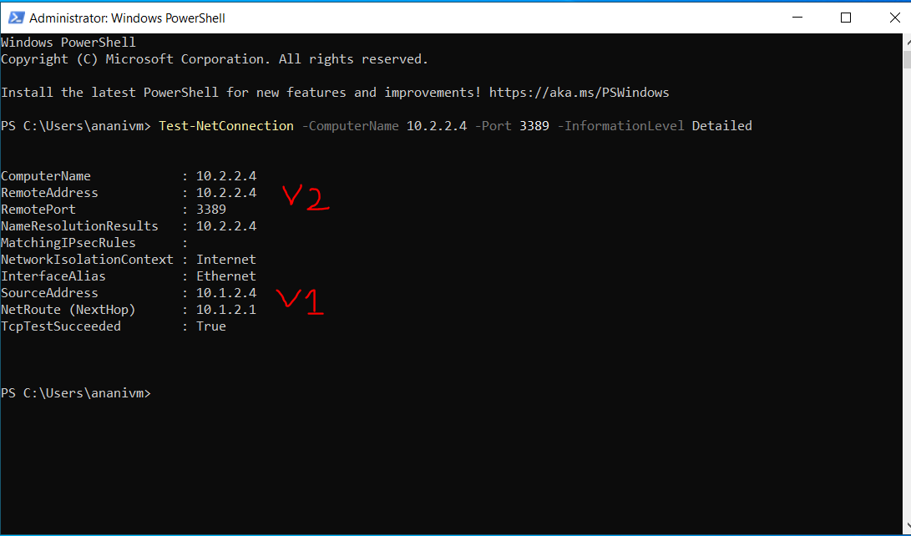

6. Findings & Analysis:
- Why VNet peering is important

VNet peering is important because it offers private communication between VNets, low latency and high bandwith. Non-overlapping IP address spaces is crucial to maintain such a good communication between VNets.

- How private IP communication was established

Private IP communication was established by connecting virtual machine between each other. More precisely by running the **Test-NetConnection** command using the private IP address of the remote computer on the source computer.

- Benefits of global peering (performance & security)

Performance → Low latency, high bandwidth, no VPN gateway overhead.

Security → Private, encrypted backbone traffic with no internet exposure.
