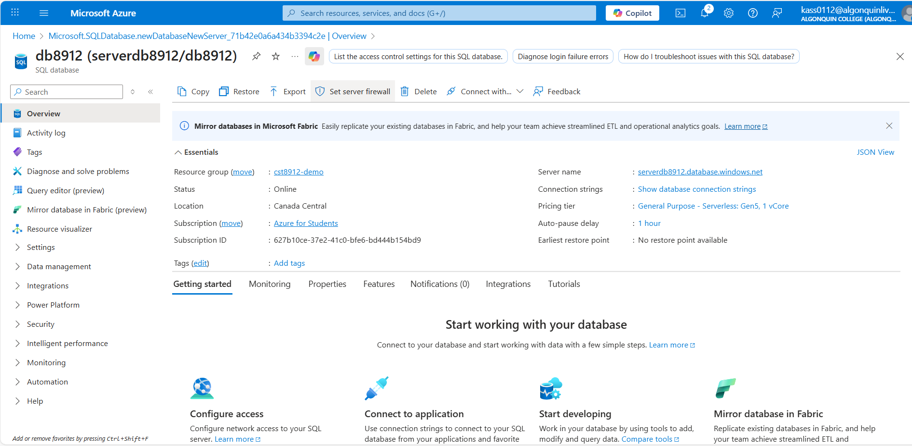
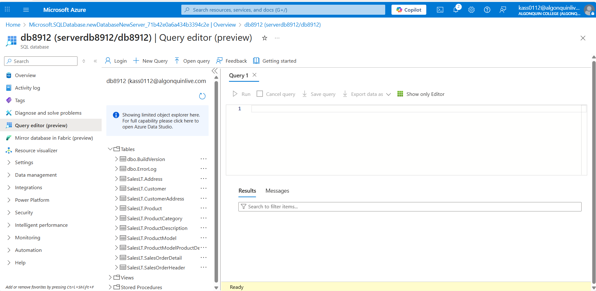
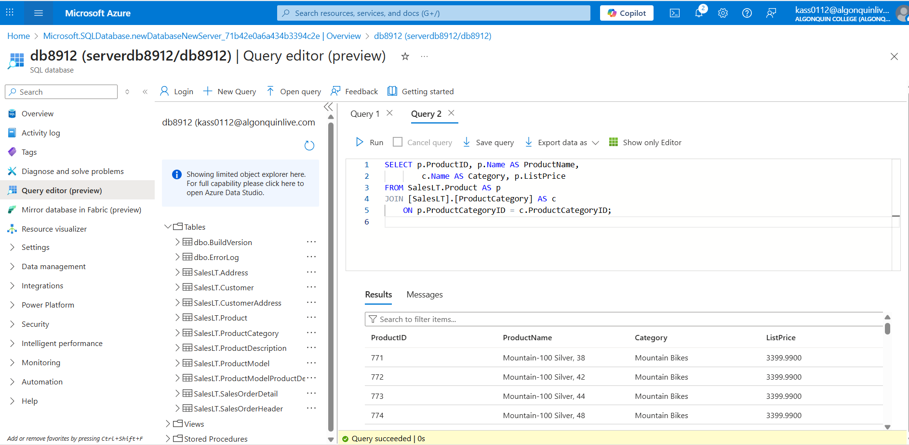
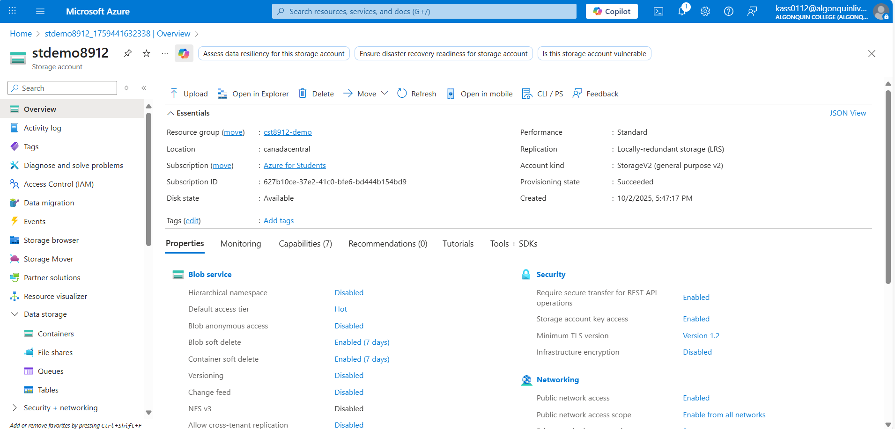
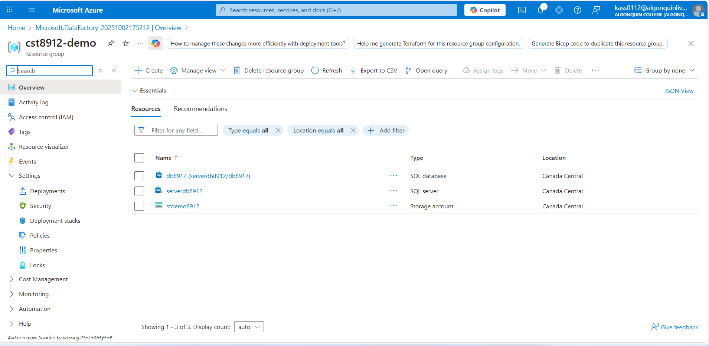
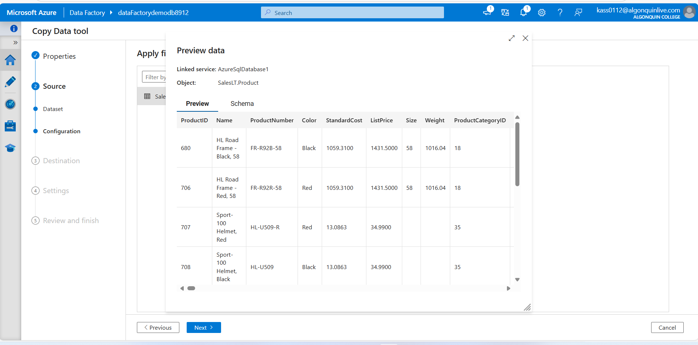
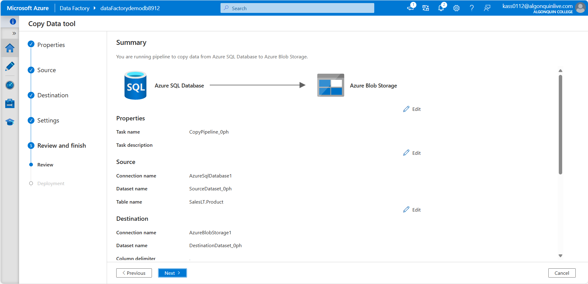
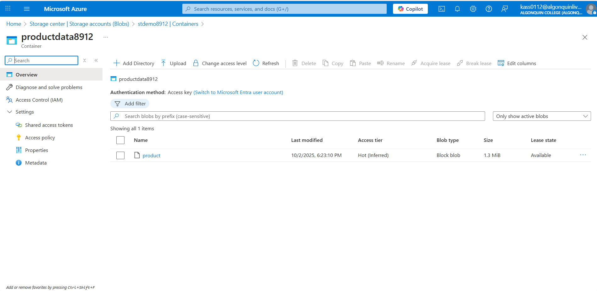
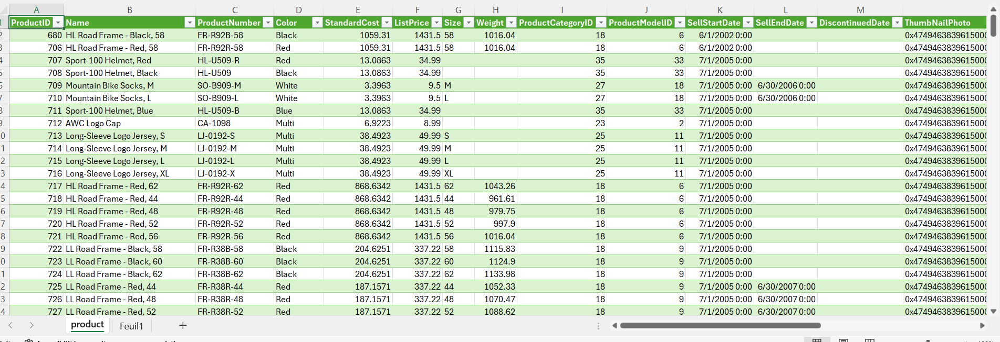

# About me 
### Full name: Anani Thierry Kassa
### Student ID: 041140713

### This find is related to steps 1 to 7
1.	Configure Azure SQL database for Canada central region under your resource group cst8912-demo, choose single database under sql databases in sql deployment option /1
2.	Enter the following values in create database page and keep other properties with their default settings  /4 
3.	On the Create SQL Database page, select Next :Networking >, and on the Networking page, in the Network connectivity section, select Public endpoint. Then select Yes for both options in the Firewall rules section to allow access to your database server from Azure services and your current client IP address.
4.	Select Next: Security > and set the Enable Microsoft Defender for SQL option to Not now.
5.	Select Next: Additional Settings > and on the Additional settings tab, set the Use existing data option to Sample (this will create a sample database that you can explore later).
6.	Select Review + Create, and then select Create to create your Azure SQL database.
7.	In the pane on the left side of the page, select Query editor (preview), and then sign in using the administrator login and password you specified for your server.

### 8.	Expand the Tables folder to see the tables in the database

### 9.	In the query 1 pane, try executing the following queries, select run to execute the query: /2

### 10.	Create a Azure storage account with the following settings, keeping the other advanced , networking, data protection, encryption settings default / 2
 

### 11.	Create a container “productdata8912” in storage account / 1

### 12.	 Create a new resource in your resource group from the azure portal, search for azure data factory with the following configuration, keeping git configuration, networking, advanced as default. / 10

 
13.	Once created launch azure data factory studio
14.	On home page, choose option to ingest data 
15.	Choose task type, built in copy task, and task cadence “run once now”
16.	In source type choose azure sql database from the dropdown, and connection, choose new connection with the following configuration and test connection
17.	 Select source table as “ SalesLT.Product” from the dropdown, click next and you can preview data
### This find is related to steps 13 to 17

18.	Click next, choose destination type, select “Azure Blob Storage” from dropdown
19.	Create new connection and test connection to storage account, choose the folder path and enter file name
20.	Choose the configuration
### This find is related to steps 18 to 20

 
### 21.	Review and finish this pipeline and check the storage account container to see the product csv file copied from the database to storage account

### 22.	Sample of the product.csv         
