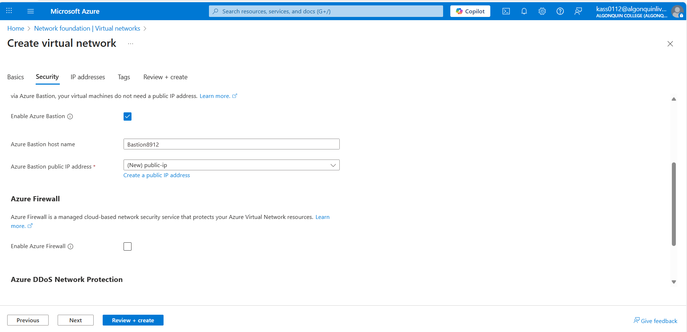
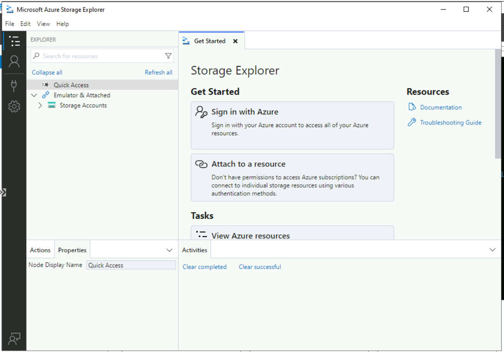

# About me 
### Full name: Anani Thierry Kassa
### Student ID: 041140713

## Lab 6
### Create a Virtual network and Bastion Host

1.	In the portal, search for and select Virtual networks.
2.	On the Virtual networks page, select + Create.
3.	On the Basics tab of Create virtual network, enter or select the following information:
4.	Select Next to proceed to the Security tab.

5.	Select Enable Bastion in the Azure Bastion section of the Security tab.
6.	Enter or select the following information in Azure Bastion:
7.	Select Next to proceed to the IP Addresses tab.

8.	In the address space box in Subnets, select the default subnet.
9.	In Edit subnet, enter or select the following information:
10.	Select save

11.	Create and review when the validation passes

### Create a Storage Account
1.	In the search box at the top of the portal, enter Storage account. Select Storage accounts in the search results.
2.	Select + Create.
3.	In the Basics tab of Create a storage account enter or select the following information:
4.	Select review 

5.	Select create

### Disable public access to storage account
1.	In the search box at the top of the portal, enter Storage account. Select Storage accounts in the search results.
2.	Select storage1 or the name of your existing storage account.
3.	In Security + networking, select Networking.
4.	In the Firewalls and virtual networks tab in Public network access, select Disabled.
5.	Select Save.

### Create private endpoint
1.	In the search box at the top of the portal, enter Private endpoint. Select Private endpoints.
2.	Select + Create in Private endpoints.
3.	In the Basics tab of Create a private endpoint, enter or select the following information.

4.	Select Next:Resource
5.	In the Resource pane, enter or select the following information.

6.	Select Next: Virtual Network.
7.	In Virtual Network, enter or select the following information.
8.	Select Next: DNS.

9.	Leave the defaults in DNS. Select Next: Tags, then Next: Review + create.
10.	Select Create.

### Create test virtual machine
1.	In the portal, search for and select Virtual machines.
2.	In Virtual machines, select + Create, then Azure virtual machine.
3.	On the Basics tab of Create a virtual machine, enter or select the following information:

4.	Select the Networking tab at the top of the page.
5.	Enter or select the following information in the Networking tab:

6.	Leave the rest of the settings at the defaults and select Review + create.
7.	Review the settings and select Create.

### Storage access key
1.	In the search box at the top of the portal, enter Storage account. Select Storage accounts in the search results.
2.	Select the storage account you created in the previous steps or your existing storage account.
3.	In the Security + networking section of the storage account, select Access keys.
4.	Select Show, then select copy on the Connection string for key1.

DefaultEndpointsProtocol=https;AccountName=storage18912b;AccountKey=6qNFQtM2yPABPUOhM3qLF6Rtd8HlDZ/tCMm+l5QTFC7xj5SBkvu2SEb5shzrYYK5wPprF3IG02A9+ASt7s9S8g==;EndpointSuffix=core.windows.net

### Add a blob container
1.	In the search box at the top of the portal, enter Storage account. Select Storage accounts in the search results.
2.	Select the storage account you created in the previous steps.
3.	In the Data storage section, select Containers.
4.	Select + Container to create a new container.
5.	Enter container in Name and select Private (no anonymous access) under Public access level.
6.	Select Create.

### Test connectivity to private endpoint
1.	In the search box at the top of the portal, enter Virtual machine. Select Virtual machines in the search results.
2.	Select 8912-VM1.
3.	In Operations, select Bastion.
4.	Enter the username and password that you entered during the virtual machine creation.
5.	Select Connect.
6.	Open Windows PowerShell on the server after you connect.
7.	Enter nslookup <storage-account-name>.blob.core.windows.net. Replace <storage-account-name> with the name of the storage account you created in the previous steps. The following example shows the output of the command.

8.	Install Microsoft Azure Storage Explorer on the virtual machine.
9.	Select Finish after the Microsoft Azure Storage Explorer is installed. Leave the box checked to open the application.

10.	Select the Power plug symbol to open the Select Resource dialog box in the left-hand toolbar.
11.	In Select Resource , select Storage account or service to add a connection in Microsoft Azure Storage Explorer to your storage account that you created in the previous steps.

12.	In the Select Connection Method screen, select Connection string, and then Next.

13.	In the box under Connection String, paste the connection string from the storage account you copied in the previous steps. The storage account name automatically populates in the box under Display name.

14.	Select Next.
15.	Verify the settings are correct in Summary.
16.	Select Connect

17.	Select your storage account from the Storage Accounts in the explorer menu.
18.	Expand the storage account and then Blob Containers.
19.	The container you created previously is displayed.

- Empty container

- Added a file to the container

20.	Close the connection to 8912-VM1.
21.	Clean all the resources created during the lab and document all the steps using screenshots and paste that in the lab report.
