# About me 
### Full name: Anani Thierry Kassa
### Student ID: 041140713

## Task 1: Use a template to provision an infrastructure
1.	In this task, you will deploy a virtual machine that will be used to test monitoring scenarios.
2.	Download the \Allfiles\Lab11\az104-11-vm-template.json lab files to your computer.
3.	Sign in to the Azure portal - https://portal.azure.com.
4.	From the Azure portal, search for and select Deploy a custom template.
5.	On the custom deployment page, select Build you own template in the editor.
6.	On the edit template page, select Load file.
7.	Locate and select the \Allfiles\Labs11\az104-11-vm-template.json file and select Open.
8.	Select Save.
9.	Use the following information to complete the custom deployment fields, leaving all other fields with their default values:
22.	Select Review + Create, then select Create.

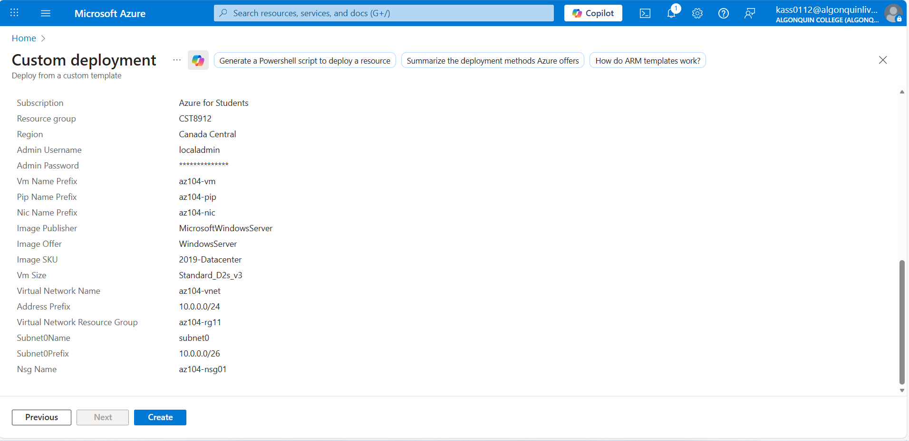

23.	Wait for the deployment to finish, then click Go to resource group.
24.	Review what resources were deployed. There should be one virtual network with one virtual machine.
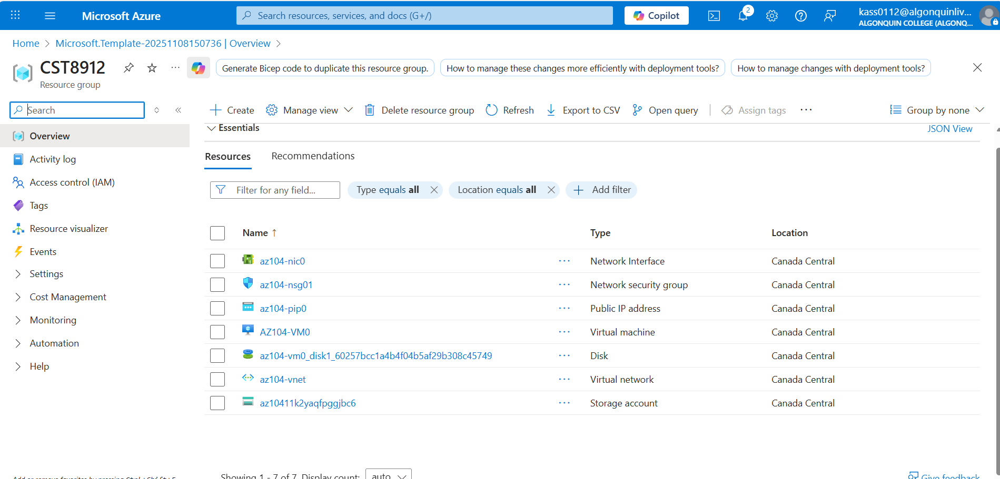

25.	Configure Azure Monitor for virtual machines (this will be used in the last task)
26.	In the portal, search for and select Monitor.
27.	Take a minute to review all the insights, detection, triage, and diagnosis tools that are available.
28.	Select View in the VM Insights box, and then select Configure Insights.
29.	Select your virtual machine, and then Enable (twice).
30.	Take the defaults for subscription and data collection rules, then select Configure.
31.	It will take a few minutes for the virtual machine agent to install and configure, proceed to the next step.
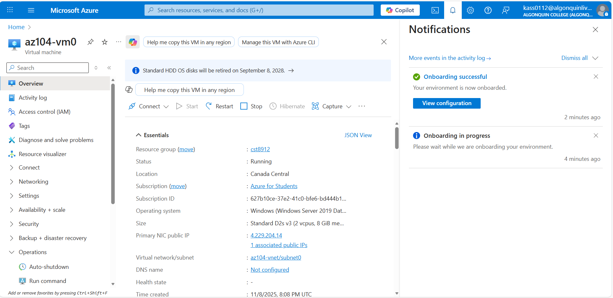

## Task 2: Create an alert
32.	In this task, you create an alert for when a virtual machine is deleted.
33.	Continue on the Monitor page , select Alerts.
34.	Select Create + and select Alert rule.
35.	Select the box for the resource group, then select Apply. This alert will apply to any virtual machines in the resource group. Alternatively, you could just specify one particular machine.
36.	Select the Condition tab and then select the See all signals link.
37.	Search for and select Delete Virtual Machine (Virtual Machines). Notice the other built-in signals. Select Apply

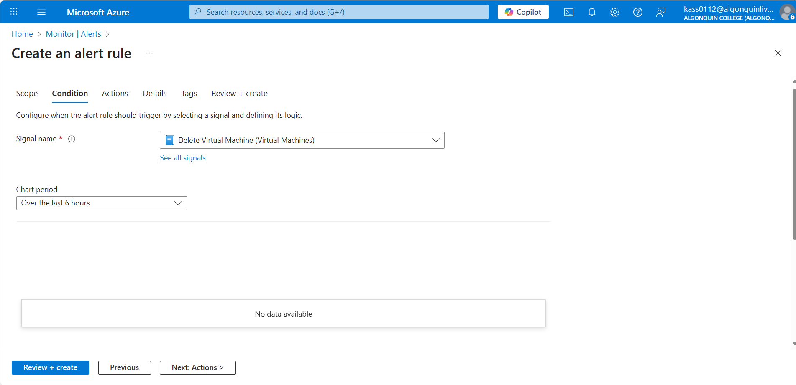
38.	In the Alert logic area (scroll down), review the Event level selections. Leave the default of All selected.
39.	Review the Status selections. Leave the default of All selected.
40.	Leave the Create an alert rule pane open for the next task.
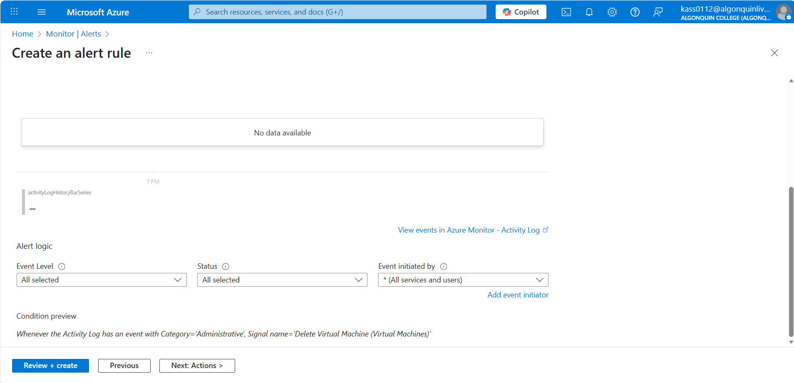

## Task 3: Configure action group notifications
1.	In this task, if the alert is triggered send an email notification to the operations team.
2.	Continue working on your alert. Select Next: Actions, and then select Create action group.
3.	On the Basics tab, enter the following values for each setting.
4.	Select Next: Notifications and enter the following values for each setting.
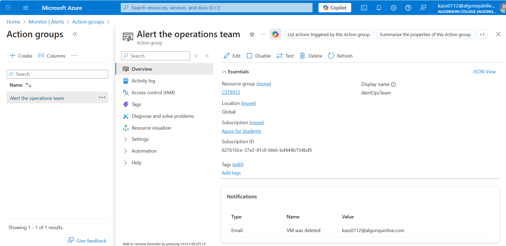
5.	Select Email, and in the Email box, enter your email address, and then select OK.
6.	Once the action group is created move to the Next: Details tab and enter the following values for each setting.
7.	Select Review + create to validate your input, then select Create.
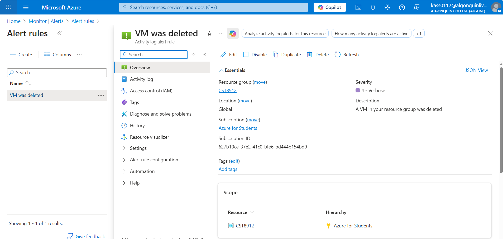

## Task 4: Trigger an alert and confirm it is working
8.	In this task, you trigger the alert and confirm a notification is sent.
Note: If you delete the virtual machine before the alert rule deploys, the alert rule might not be triggered.
9.	In the portal, search for and select Virtual machines.
10.	Check the box for the az104-vm0 virtual machine.
11.	Select Delete from the menu bar.
12.	Check the box for Apply force delete. Enter delete to confirm and then select Delete.
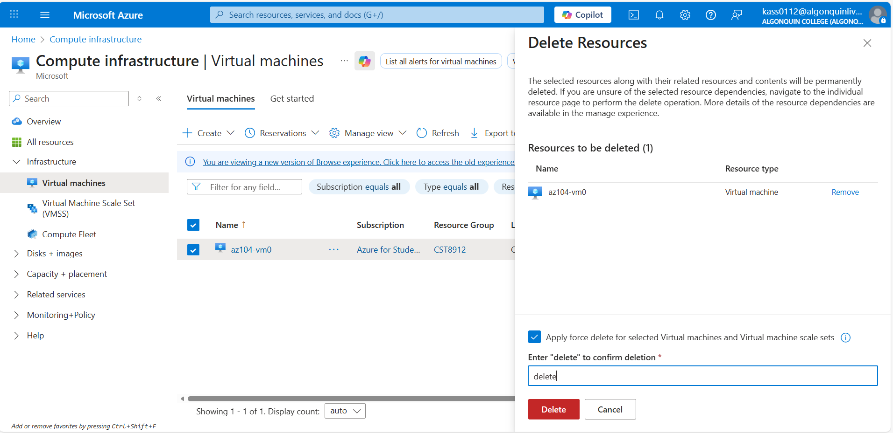

13.	In the title bar, select the Notifications icon and wait until vm0 is successfully deleted.
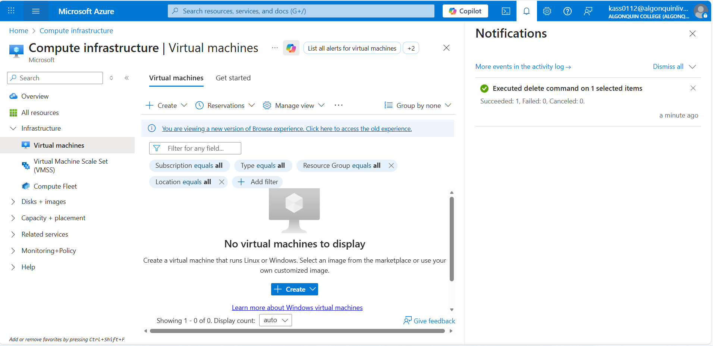

14.	You should receive a notification email that reads, Important notice: Azure Monitor alert VM was deleted was activated... If not, open your email program and look for an email from azure-noreply@microsoft.com.
15.	Screenshot of alert email.
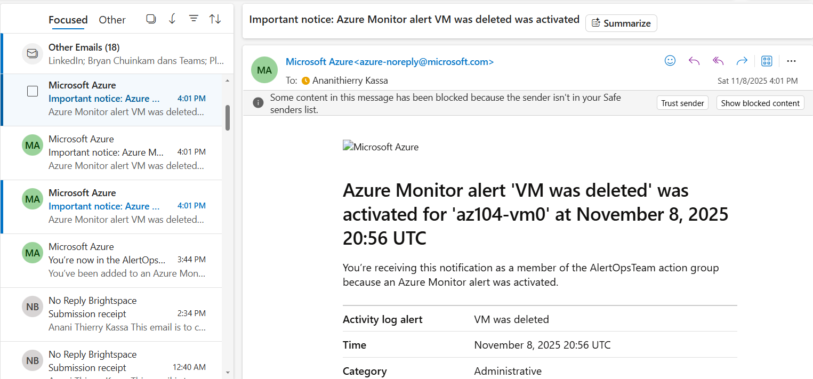

16.	On the Azure portal resource menu, select Monitor, and then select Alerts in the menu on the left.
17.	You should have verbose alerts that were generated by deleting vm0.
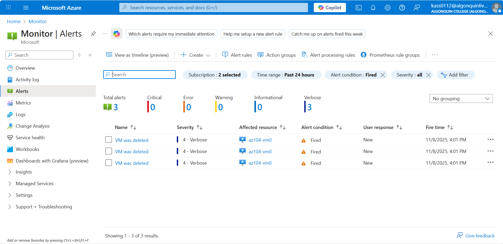
18.	Note: It can take a few minutes for the alert email to be sent and for the alerts to be updated in the portal. If you don't want to wait, continue to the next task and then return.
19.	Select the name of one of the alerts (For example, VM was deleted). An Alert details pane appears that shows more details about the event.
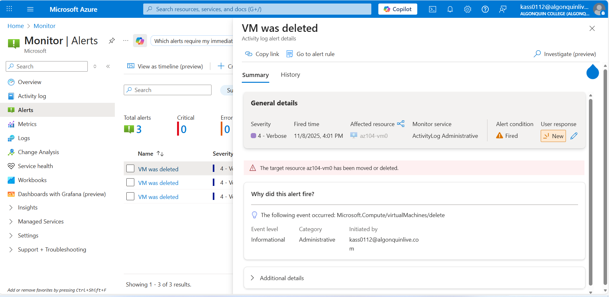

## Task 5: Configure an alert processing rule
1.	In this task, you create an alert rule to suppress notifications during a maintenance period.
2.	Continue in the Alerts blade, select Alert processing rules and then + Create.
3.	Select your resource group, then select Apply.
4.	Select Next: Rule settings, then select Suppress notifications.
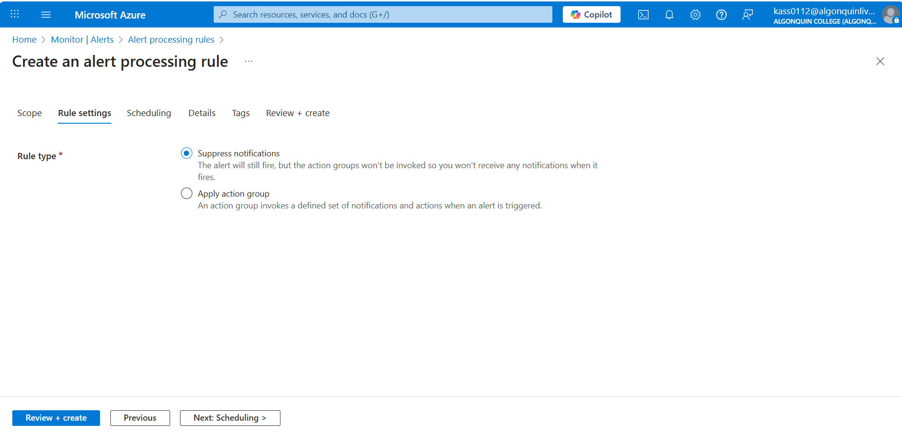

5.	Select Next: Scheduling.
6.	By default, the rule works all the time, unless you disable it or configure a schedule. You are going to define a rule to suppress notifications during overnight maintenance. Enter these settings for the scheduling of the alert processing rule:
Screenshot of the scheduling section of an alert processing rule
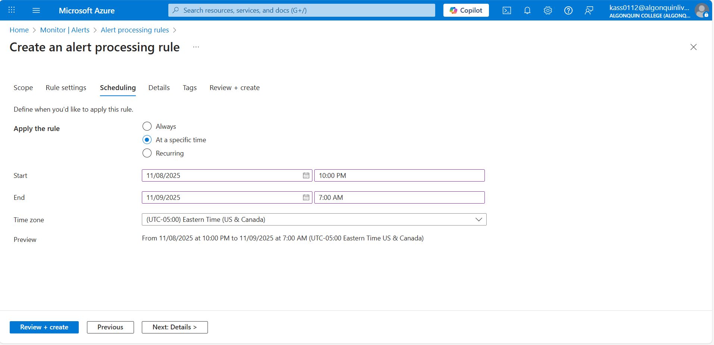
7.	Select Next: Details and enter these settings:
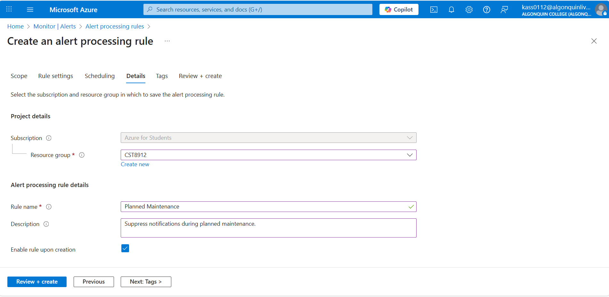
8.	Select Review + create to validate your input, then select Create.
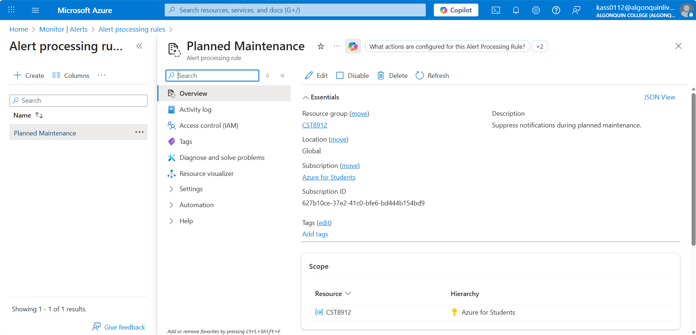

## Task 6: Use Azure Monitor log queries
9.	In this task, you will use Azure Monitor to query the data captured from the virtual machine.
10.	In the Azure portal, search for and select Monitor blade, click Logs.
11.	If necessary close the splash screen.
12.	Select a scope, your resource group. Select Apply.
13.	In the Queries tab, select Virtual machines (left pane).
14.	Review the queries that are available. Run (hover over the query) the Count heartbeats query.
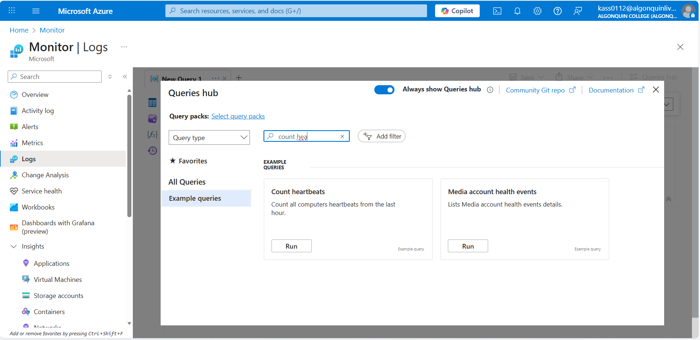
15.	You should receive a heartbeat count for when the virtual machine was running.
16.	Review the query. This query uses the heartbeat table.
17.	Replace the query with this one, and then click Run. Review the resulting chart.

 InsightsMetrics
 | where TimeGenerated > ago(1h)
 | where Name == "UtilizationPercentage"
 | summarize avg(Val) by bin(TimeGenerated, 5m), Computer //split up by computer
 | render timechart

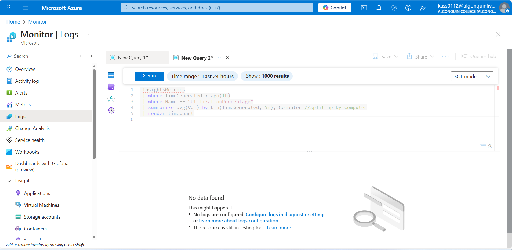

18.	As you have time, review and run other queries.
19.	Clean up the resources and document all the steps in the lab report
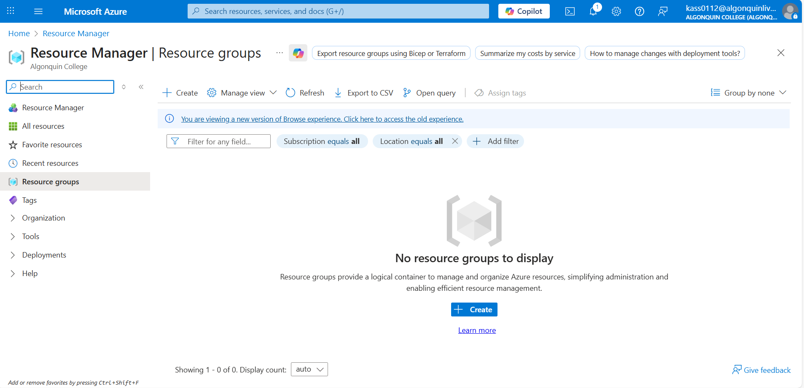

