# About me 
### Full name: Anani Thierry Kassa
### Student ID: 041140713

## Task 1: Assign tags via the Azure portal
1.	Sign in to the Azure portal - https://portal.azure.com.
2.	Search for and select Resource groups.
3.	From the Resource groups, select + Create.
5.	Select Next: Tags and create a new tag.
6.	Select Review + Create, and then select Create.

## Task 2: Enforce tagging via an Azure policy
7.	In the Azure portal, search for and select Policy.
8.	In the Authoring blade, select Definitions. Take a moment to browse through the list of built-in policy definitions that are available for you to use. Notice you can also search for a definition.
9.	Search for “require a tag”
10.	Screenshot of the policy definition.
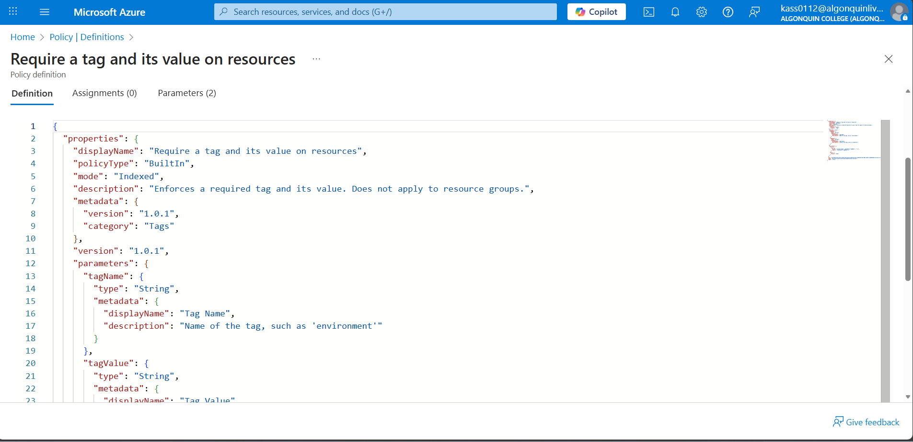
11.	Click the entry representing the Require a tag and its value on resources built-in policy. Take a minute to review the definition.
12.	On the Require a tag and its value on resources built-in policy definition blade, click Assign.
13.	Specify the Scope by clicking the ellipsis button and selecting the following values. Click Select when you are done.
14.	Configure the Basics properties of the assignment by specifying the following settings (leave others with their defaults):
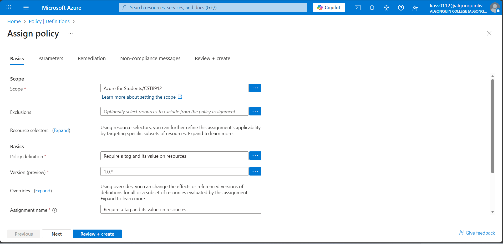
16.	Click Next twice and set Parameters to the following values:
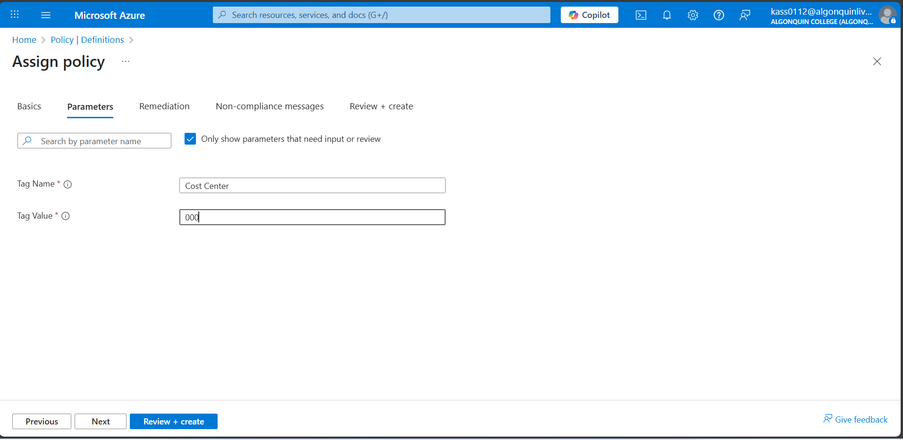
17.	Click Next and review the Remediation tab. Leave the Create a Managed Identity checkbox unchecked

18.	Click Review + Create and then click Create.

19.	Note: Now you will verify that the new policy assignment is in effect by attempting to create an Azure Storage account in the resource group. You will create the storage account without adding the required tag.
20.	Note: It might take between 5 and 10 minutes for the policy to take effect.
21.	In the portal, search for and select Storage Account, and select + Create.
22.	On the Basics tab of the Create storage account blade, complete the configuration.
23.	Select Review and then click Create.
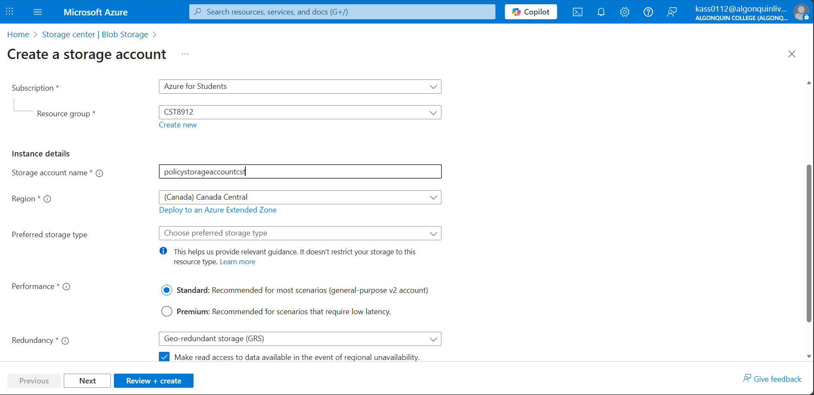
24.	You should receive a Validation failed message. View the message to identify the reason for the failure. Verify the error message states that the resource deployment was disallowed by the policy.
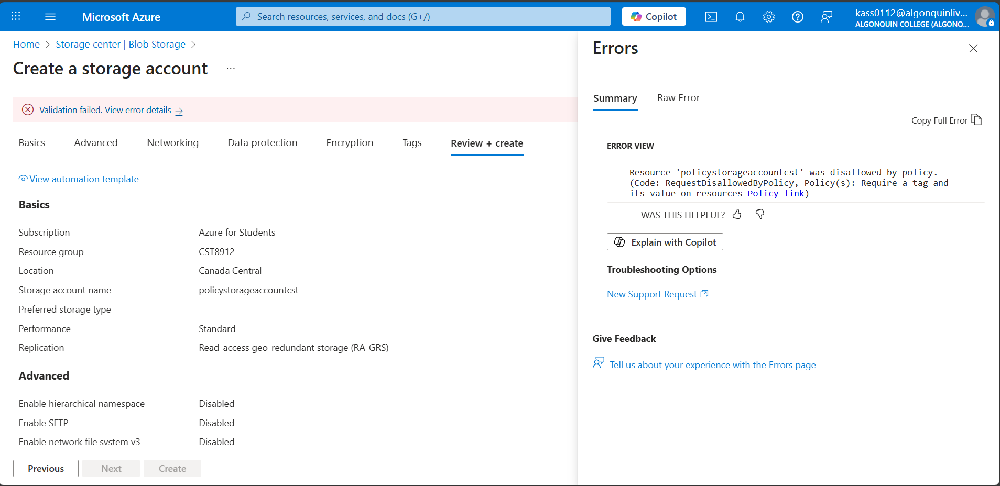

## Task 3: Apply tagging via an Azure policy
1.	In this task, we will use the new policy definition to remediate any non-compliant resources. In this scenario, we will make any child resources of a resource group inherit the Cost Center tag that was defined on the resource group.
2.	In the Azure portal, search for and select Policy.
3.	In the Authoring section, click Assignments.
4.	In the list of assignments, click the ellipsis icon in the row representing the Require Cost Center tag with Default value policy assignment and use the Delete assignment menu item to delete the assignment.
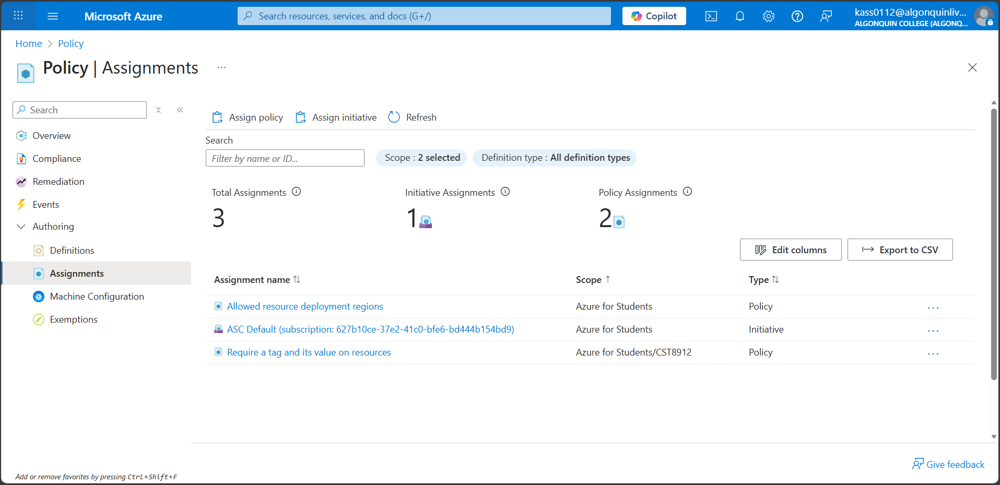
5.	Click Assign policy and specify the Scope by clicking the ellipsis button and selecting the following values:
6.	To specify the Policy definition, click the ellipsis button and then search for and select Inherit a tag from the resource group if missing.
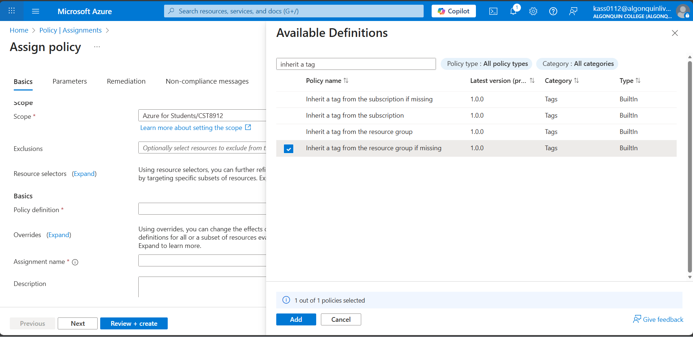

7.	Select Add and then configure the remaining Basics properties of the assignment.
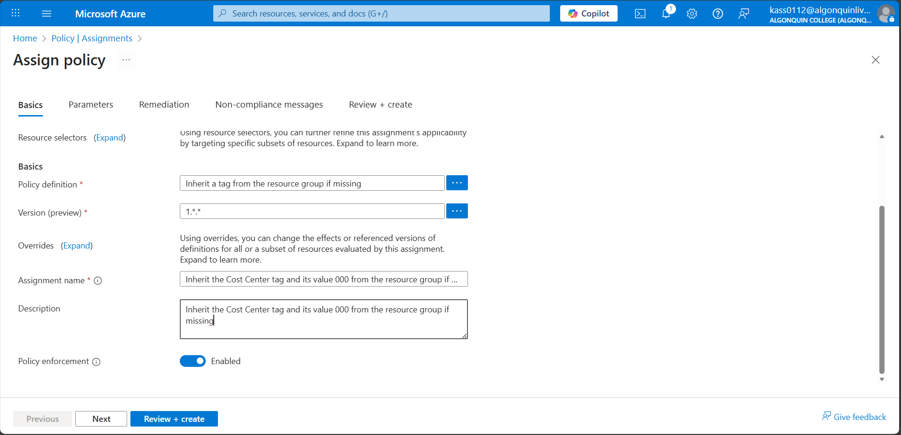
8.	Click Next twice and set Parameters to the following values:
9.	Click Next and, on the Remediation tab, configure the following settings (leave others with their defaults):
10.	Screenshot of the policy remediation page. 
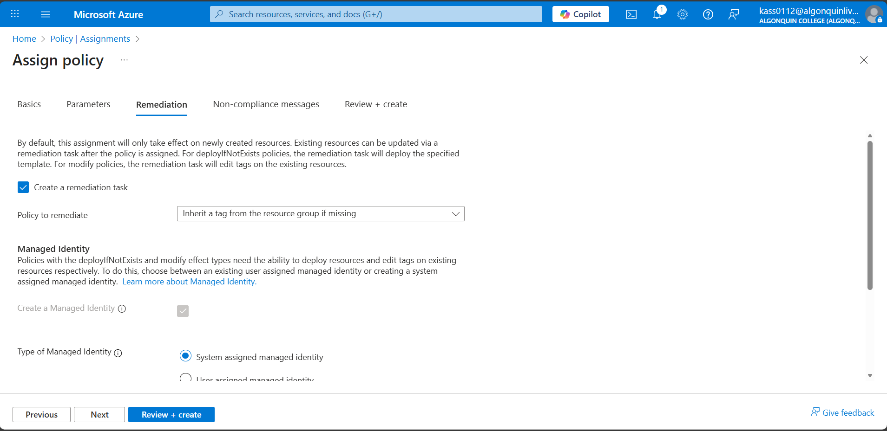

11.	Click Review + Create and then click Create.

Note: To verify that the new policy assignment is in effect, you will create another Azure storage account in the same resource group without explicitly adding the required tag.
Note: It might take between 5 and 10 minutes for the policy to take effect.
Search for and select Storage Account, and click + Create.

12.	On the Basics tab of the Create storage account blade, verify that you are using the Resource Group that the Policy was applied to and specify the following settings (leave others with their defaults) and click Review:

13.	Verify that this time the validation passed and click Create.
14.	Once the new storage account is provisioned, click Go to resource.
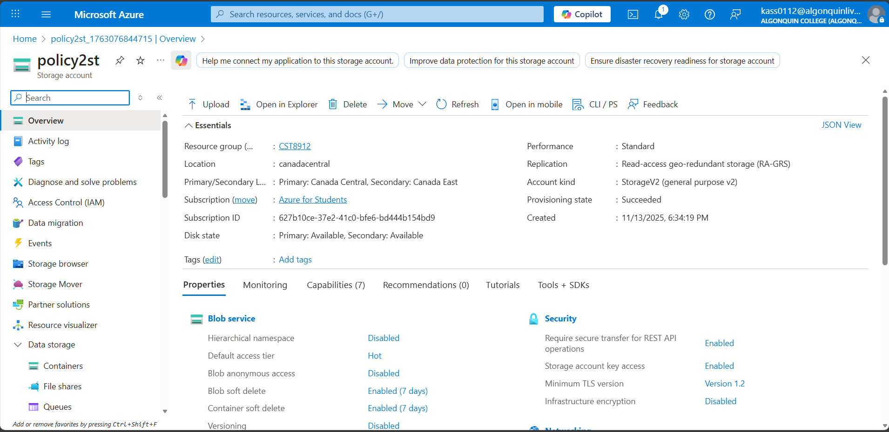
15.	On the Tags blade, note that the tag Cost Center with the value 000 has been automatically assigned to the resource.
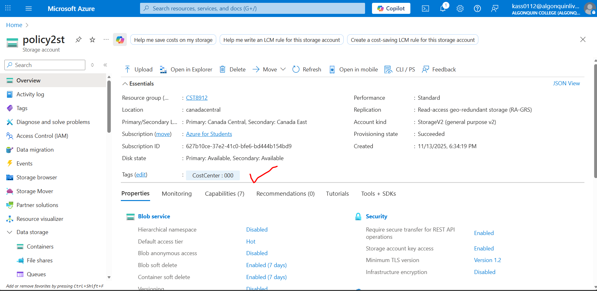

## Task 4: Configure and test resource locks
1.	Search for and select your resource group.
2.	In the Settings blade, select Locks.
3.	Select Add and complete the resource lock information. When finished select Ok.
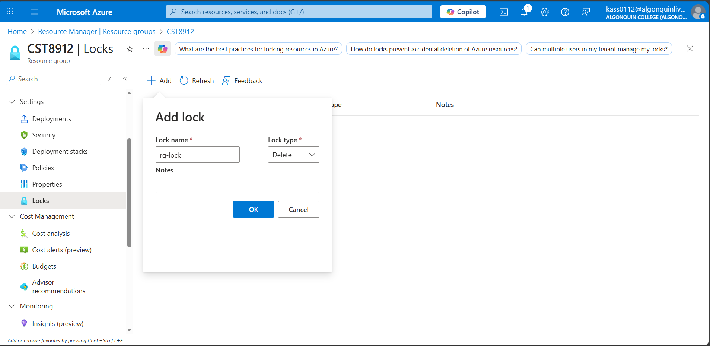
4.	Navigate to the resource group Overview blade, and select Delete resource group.
5.	In the Enter resource group name to confirm deletion textbox provide the resource group name, cst8912. Notice you can copy and paste the resource group name.
6.	Notice the warning: Deleting this resource group and its dependent resources is a permanent action and cannot be undone. Select Delete.
7.	You should receive a notification denying the deletion.
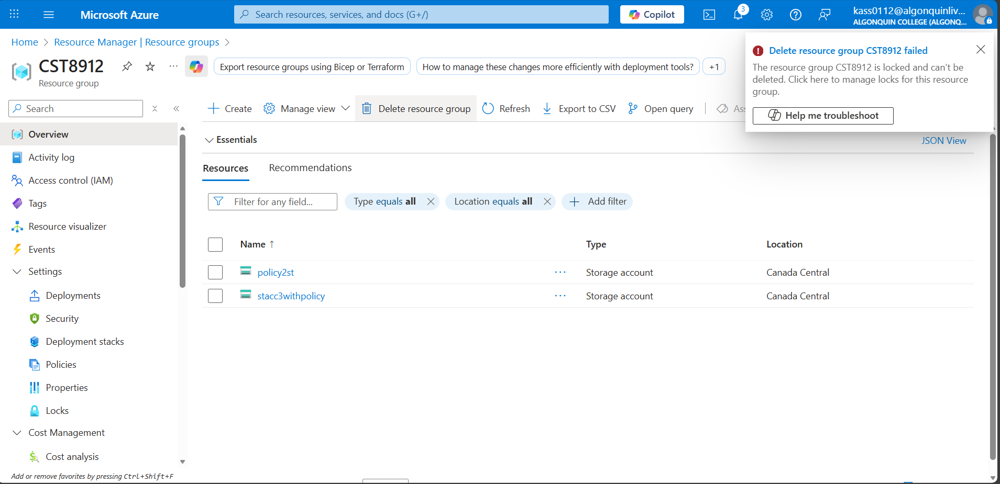

## Task 5: Clean up the resources 
1.	In the portal, search for and select Policy.
2.	In the Authoring section, click Assignments, click the ellipsis icon to the right of the assignment you created in the previous task and click Delete assignment.
3.	In the portal, search for and select Storage accounts.
4.	In the list of storage accounts, select the resource group corresponding to the storage account you created in the last task of this lab. Select Tags and click Delete (Trash can to the right) to the Role:Infra tag and press Apply.
5.	Click Overview and click Delete on the top of the storage account blade. When prompted for the confirmation, in the Delete storage account blade, type the name of the storage account to confirm and click Delete.
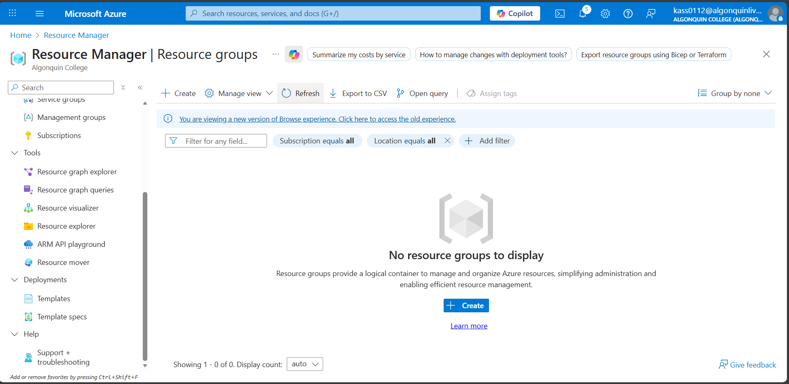